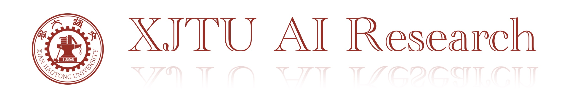

XJTU AI Research is dedicated to researching cutting-edge AI technologies. We firmly believe that the value of technology lies in its ability to enhance productivity, rather than solely in being published in high-impact journals or conferences—at least, this should not be the only criterion for evaluation. Our focus areas include

- [Medical AI](https://xjtuai.com/histogym/)
- Green AI 
- Material AI
- Art AI
- Large Language Models
- Embodied Intelligence 
- Swarm Intelligence
- Multi-agent Reinforcement Learning
    
   
  Our goal is to push the boundaries of artificial intelligence and develop innovative solutions that address complex challenges across various domains.

    

        
    

    

        <h3>HistoGym</h3>
        

            HistoGym: A Reinforcement Learning Environment for Histopathological Image Analysis.
            <a href="https://xjtuai.com/histogym/">Learn more</a>
        

    

